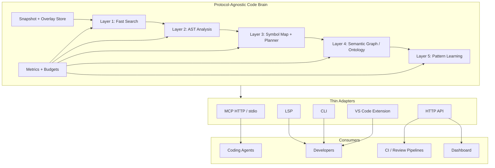

# Semantic Code Intelligence Vision

## Executive Summary

Semantic Code Intelligence is a local-first code-intelligence workbench for agents and developers. It turns a repository into a queryable, snapshot-aware semantic substrate: fast text search, structural AST understanding, symbol/refactoring plans, ontology-backed relationships, and learned code patterns exposed through thin protocol adapters.

The product is broader than an LSP server. LSP remains one interface, but the center of gravity is a protocol-agnostic code brain serving MCP, HTTP, CLI, editor extensions, CI, and future agent workflows from the same core contracts.

## North Star

Make large codebases feel small, safe, and explainable for both humans and coding agents.

A developer or agent should be able to ask:

- Where is this concept defined and used?
- What symbols, files, and architectural relationships are nearby?
- What change plan would safely rename, move, or refactor this?
- Which project patterns should this code follow?
- What evidence says this patch is safe to apply?

…and receive bounded, deterministic answers tied to a repository snapshot rather than ad-hoc shell output or stale conversational memory.

## Core Philosophy: Living Code Memory

Code understanding is about relationships, patterns, and evolution:

- **Relationships**: symbols, imports, calls, concepts, files, tests, and ownership boundaries.
- **Patterns**: naming, error handling, layering, refactoring recipes, and team conventions.
- **Evolution**: how those relationships and patterns change over time.

Semantic Code Intelligence should become a living memory for a codebase: fast enough for daily navigation, precise enough for safe edits, and structured enough for agent orchestration.

## Product Boundaries

### In scope

- Snapshot-aware text search, symbol search, AST queries, graph expansion, file reads, and patch proposals.
- A unified TypeScript/Bun core with thin LSP, MCP, HTTP, and CLI adapters.
- Tree-sitter-backed structural analysis for common languages.
- Symbol maps and rename/refactoring plans with preview-first behavior.
- Optional ontology/semantic graph enrichment behind a storage port.
- Pattern learning and propagation as opt-in assistance, not hidden mutation authority.
- CI and local validation hooks for proposed patches.

### Out of scope for the core

- Acting as the canonical task, decision, or governance authority.
- Replacing dedicated language servers for deep type inference in every path.
- Unbounded autonomous editing without snapshot, diff, and validation gates.
- Treating learned patterns as policy unless promoted through an owning governance surface.

## Architecture: One Brain, Many Interfaces

## Layer Strategy

### Layer 1: Fast Search

Ripgrep-backed text search, glob/list operations, ignore handling, result caps, caching, and budgeted streaming. This is the default first hop for most queries.

### Layer 2: AST Analysis

Tree-sitter parsing for structural queries: identifiers, imports, classes, functions, calls, and language-aware ranges. This validates and enriches Layer 1 results.

### Layer 3: Planner

Symbol maps, references, rename previews, and patch planning. This layer turns code understanding into safe proposed change sets.

### Layer 4: Semantic Graph / Ontology

Concepts, relations, anchors, k-hop exploration, and storage adapters. This layer should enrich navigation and explanation without sitting on every hot path.

### Layer 5: Pattern Learning

Pattern detection, confidence scoring, feedback loops, and propagation suggestions. This is advisory and gated by configuration.

## LLM-Friendly Tool Surface

The primary agent interface should be snapshot-aware MCP/HTTP tools:

- `get_snapshot` → returns a snapshot id for git HEAD plus overlay state.
- `text_search(query, glob?, kind?, case?, limit?, context?, snapshot)`
- `symbol_search(query, lang?, path_hint?, limit?, snapshot)`
- `ast_query(language, query, paths?, glob?, snapshot)`
- `graph_expand(symbol|file, edges?, depth?, limit?, snapshot)`
- `read_file(path, range?, snapshot)`
- `find_definition(symbol?, path?, snapshot)`
- `find_references(symbol?, path?, snapshot)`
- `propose_patch(diff, run_checks?, snapshot)`
- `run_checks(commands?, snapshot)`

These tools should replace unbounded grep/read/sed behavior in agent workflows when precision, repeatability, or edit safety matters.

## Implementation Priorities

### Phase A: Stabilize the Code Brain

- Keep the unified core as the single source of behavior.
- Normalize operation contracts and error envelopes across MCP, HTTP, CLI, and LSP.
- Require snapshot ids for multi-step workflows.
- Preserve protocol stdout cleanliness for stdio transports.
- Track p50/p95/p99 latency and backend routing decisions.

### Phase B: Make Edits Safe

- Strengthen overlay and patch proposal flow.
- Run format, lint, typecheck, and targeted tests before accepting patches.
- Emit reviewable evidence for every proposed mutation.
- Keep direct write behavior out of the core agent path.

### Phase C: Improve Precision

- Add or refresh offline SCIP/LSIF indices for definitions/references where useful.
- Use language servers as feature-flagged boosters for typed rename or implementation lookup.
- Post-validate LSP-derived edits with AST/SCIP and repository checks.

### Phase D: Grow Semantic Memory

- Harden StoragePort adapters for SQLite, Postgres, and triple-store backends.
- Keep ontology enrichment budgeted and observable.
- Use pattern learning to suggest, not silently enforce, project conventions.

## Success Metrics

### Reliability

- Same query against the same snapshot returns stable results.
- Cross-adapter parity for core operations.
- Clear error envelopes and no protocol-stdout contamination.

### Performance

- p95 under 100ms for common read/navigation operations.
- Explicit budgets and circuit breakers for expensive semantic or LSP-backed operations.
- Cache hit rates and escalation ratios visible in metrics.

### Edit Safety

- Every patch is previewable as a diff.
- Validation commands and outcomes are attached to proposed changes.
- Failed checks preserve diagnostic context without partially applying changes.

### Usefulness

- Developers and agents find definitions, references, related concepts, and safe rename plans faster than with ad-hoc shell workflows.
- Learned patterns improve suggestions without becoming opaque policy.
- The system makes repository structure easier to explain and onboard.

## Repository Identity

The repo is named **Semantic Code Intelligence** because the durable product is not the transport. LSP is one adapter. MCP is one adapter. HTTP and CLI are adapters. The durable asset is the code brain: a semantic, snapshot-aware intelligence layer for software repositories.

Package and command names may retain compatibility aliases such as `ontology-lsp` where useful, but new documentation should prefer **Semantic Code Intelligence** for the product and repo identity.

## The Vision Realized

Semantic Code Intelligence becomes a repository's shared programming memory:

1. It sees code through text, syntax, symbols, concepts, and patterns.
2. It answers with bounded evidence tied to a snapshot.
3. It proposes changes as reviewable plans, not hidden mutations.
4. It learns from accepted and rejected suggestions.
5. It gives coding agents and humans the same reliable substrate.

This is programming augmented by structured code intelligence: fast enough for flow, safe enough for automation, and explicit enough to trust.
